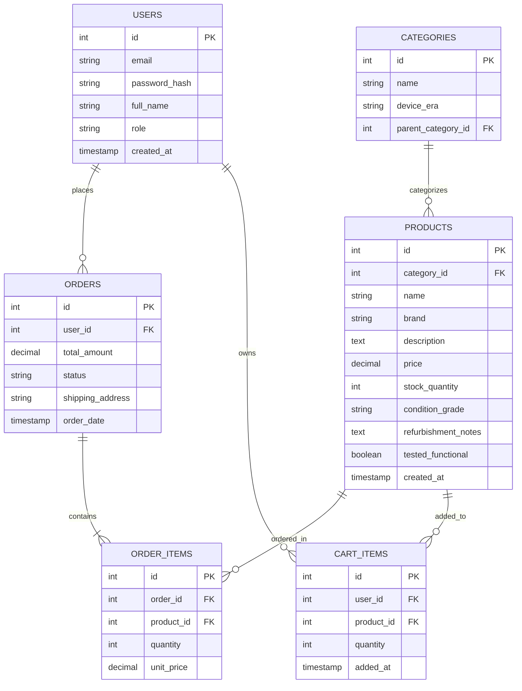

# Sprint 1: System Architecture & Scope Definition
## Project: RetroPulse — Refurbished Vintage Electronics & Gaming Marketplace

---

## Section 1: Target Audience & Market Focus

**Primary Persona:**
The platform primarily targets **collectors and nostalgic enthusiasts (ages 25–45)** seeking refurbished vintage gaming consoles, handhelds, and retro electronics (CRTs, cassette/vinyl players, early computers), alongside **budget-conscious retro gamers** looking for working hardware without paying new-condition premiums. A secondary persona is the **restoration hobbyist**, who buys parts, faulty "for repair" units, and tools rather than fully refurbished finished products.

**Core Pain Point:**
Buyers of used/vintage electronics on general marketplaces face high uncertainty around item condition, functional testing, and authenticity (e.g., "does this NES actually still read cartridges?", "is this a genuine Sega Genesis motherboard revision?"). Generic platforms don't support condition grading standards, refurbishment disclosure (what was replaced/repaired), or console-specific/component-specific filtering, leading to high return rates and buyer distrust. RetroPulse solves this with standardized condition grading, refurbishment transparency, and tested-functionality guarantees baked into the product model itself.

**Domain Scope:**
Refurbished Vintage Electronics & Gaming (Vertical: Consumer Electronics → Retro/Vintage), covering:
- Gaming consoles & handhelds (NES, SNES, Genesis, Game Boy, PS1/PS2, etc.)
- Vintage computers & peripherals (Commodore 64, Apple II, early PCs)
- Audio/video electronics (CRT TVs, cassette decks, turntables, boomboxes)
- Individual parts & repair components (capacitors, controllers, cartridges, replacement shells)

---

## Section 2: MVP Feature Scope

| Category | Feature Name | Description | Priority |
|---|---|---|---|
| Authentication | User Registration & Authentication | Password hashing (bcrypt) and JWT-based authentication for buyer/seller accounts. | High (MVP) |
| Catalog | Product List & Search | Browsing interface with taxonomy-based filtering (device type, era/decade, brand, condition grade, price range). | High (MVP) |
| Catalog | Product Detail & Condition Report | Product page listing refurbishment notes (parts replaced, tested functionality checklist), condition grade, and images. | High (MVP) |
| Cart | Cart Management | State-persistent cart management (item addition, modification, and deletion). | High (MVP) |
| Checkout | Order Processing | Mock/Stripe payment gateway integration and order object instantiation. | High (MVP) |
| Admin | Inventory Control | Administrative CRUD operations for product inventory, including refurbishment status updates. | Medium |
| Catalog | Condition Grading & Authenticity Tags | Standardized grading scale (e.g., "Fully Restored," "Untested/As-Is," "Working — Cosmetic Wear") applied per listing. | Medium |

*(Six workflows defined, within the 4–6 range; two flagged Medium priority as stretch goals depending on timeline.)*

---

## Section 3: Tech Stack Selection & Justification

- **Frontend Framework: React (with Vite)**
  Justification: React's component reusability fits a filter-heavy, image-dense catalog UI (condition photos, before/after refurb shots). Vite's fast HMR speeds up iteration during the sprint. Vue was considered for its gentler learning curve but React was chosen for broader team familiarity and richer ecosystem support for image galleries/zoom components common in listing pages.

- **Backend Infrastructure: Node.js / Express**
  Justification: A lightweight REST API in Express keeps the stack single-language (JS/TS) across frontend and backend, easing team coordination on an academic timeline. FastAPI was considered for its speed and auto-generated docs, but Express was preferred since the team's existing familiarity reduces onboarding risk more than raw performance gains matter for MVP scope.

- **Database Management System: PostgreSQL**
  Justification: Orders, inventory, and condition-grading data are highly relational with strict integrity needs (e.g., stock must decrement atomically on purchase, condition grade must map to a fixed enum). PostgreSQL's constraint enforcement and transactional guarantees outweigh MongoDB's schema flexibility, which isn't needed since attributes like condition grade and device category are well-defined and don't vary unpredictably per product.

- **Caching & Asynchronous Processing (Optional): Redis**
  Justification: Redis caches high-traffic filtered catalog queries (e.g., "all NES consoles, Grade A, under $150") and stores guest-cart session state, reducing repeated PostgreSQL load. It could also queue background image-processing jobs (thumbnail generation) for uploaded refurbishment photos if time allows.

---

## Section 4: Entity-Relationship Diagram (ERD)

**Relationship & Cardinality Summary:**

| Relationship | Cardinality | Notes |
|---|---|---|
| USERS → ORDERS | 1:N | A user can place many orders; each order belongs to one user. |
| USERS → CART_ITEMS | 1:N | A user's cart is composed of many cart item rows. |
| ORDERS → ORDER_ITEMS | 1:N | An order contains multiple line items (associative entity). |
| PRODUCTS → ORDER_ITEMS | 1:N | A product can appear in many order line items across different orders. |
| PRODUCTS → CART_ITEMS | 1:N | A product can sit in many users' carts simultaneously. |
| CATEGORIES → PRODUCTS | 1:N | Each product belongs to exactly one category (e.g., "Handheld Consoles"); a category groups many products. |
| CATEGORIES → CATEGORIES | 1:N (self-referencing) | Supports nested taxonomy (e.g., "Consoles" → "8-Bit Era" → "Nintendo"). |

**Key Design Notes:**
- `ORDER_ITEMS` and `CART_ITEMS` are associative (junction) entities resolving the N:M relationships between `PRODUCTS` and `ORDERS`/`USERS` respectively.
- `unit_price` is stored redundantly on `ORDER_ITEMS` (rather than joined live from `PRODUCTS`) to preserve historical price accuracy since vintage item prices can fluctuate with market/collector demand.
- `condition_grade`, `refurbishment_notes`, and `tested_functional` on `PRODUCTS` are domain-specific attributes addressing the core pain point (condition uncertainty) that distinguishes this schema from a generic e-commerce catalog.

---

## Submission Checklist
- [ ] Initialize GitHub repository
- [ ] Add instructor/TA as collaborators
- [ ] Commit this file as `/docs/SPRINT_1.md`
- [ ] Submit repository URL to LMS
