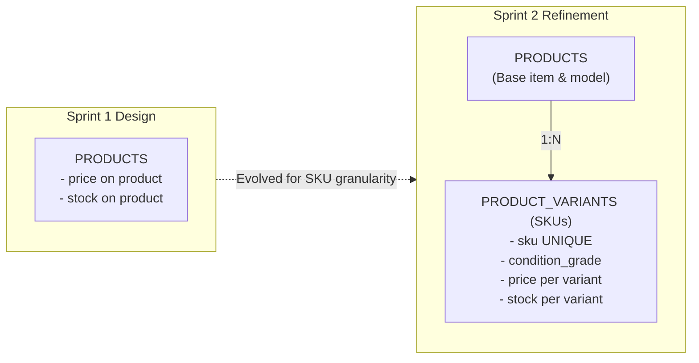
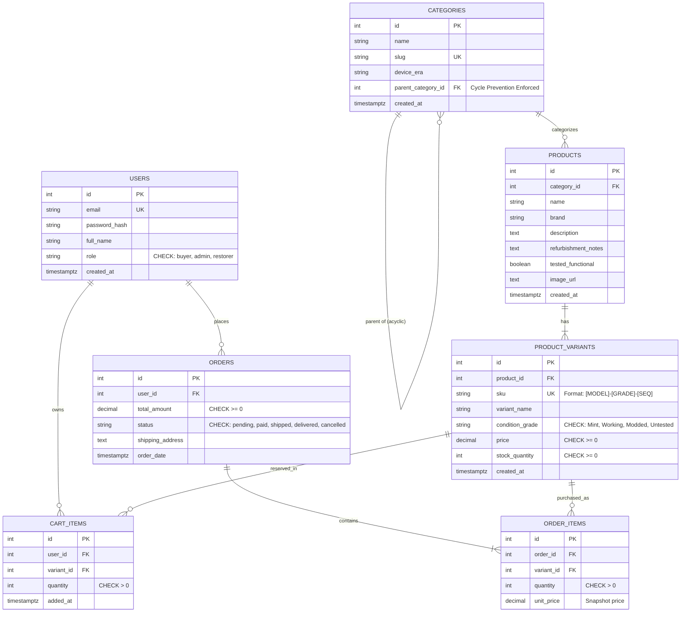

# Sprint 2: Data Modeling, Database Implementation & REST API Architecture
## Project: RetroPulse — Refurbished Vintage Electronics & Gaming Marketplace

---

## 1. Sprint Goal and Scope Boundary

### 1.1 Sprint Goal
The goal of Sprint 2 is to translate the conceptual architecture from Sprint 1 into an operational relational database schema and a secured, test-driven RESTful administrative API. Specifically, this sprint implements:
- Hierarchical category taxonomy with cycle prevention.
- Product variant and SKU-level inventory tracking with strict non-negative stock invariants.
- Role-based authorization safeguarding all administrative endpoints against unauthorized access.
- Full automated test coverage verifying every critical business rule.

### 1.2 Scope Boundary

| In-Scope (Implemented & Tested) | Out-of-Scope (Deferred to Sprint 3 / Later) |
|---|---|
| PostgreSQL schema DDL with relational integrity (`migrations/001_initial_schema.sql`) | Third-party payment gateway integration (Stripe / PayPal webhook live listeners) |
| Authentic domain seed dataset (`seeds/001_seed_data.sql`) | Frontend UI implementation (React components and styling) |
| Category hierarchy validation and graph cycle prevention | Elasticsearch / Algolia full-text search integration |
| Product Variant & SKU combination uniqueness rules | Automated courier shipping label generation |
| Atomic stock deduction, restock rules, and non-negative constraints | Live Redis caching server deployment (simulated / optional) |
| Role-based access control middleware for administrative endpoints | User reviews, ratings, and community forums |
| Automated test suite covering all mandatory business rules | |

---

## 2. Link to Sprint 1 Decisions That This Sprint Reuses or Changes

### 2.1 Reused Decisions
- **Domain Focus:** Retained the vintage electronics and retro gaming vertical (NES, Sega Genesis, CRT monitors, handhelds, mod components).
- **Core Entities:** Reused `USERS`, `CATEGORIES`, `PRODUCTS`, `ORDERS`, and `CART_ITEMS` from the Sprint 1 ERD.
- **Tech Stack:** Implemented in Node.js / Express backend with PostgreSQL relational schema as justified in Sprint 1.
- **Refurbishment Transparency:** Preserved `refurbishment_notes`, `condition_grade`, and `tested_functional` attributes.

### 2.2 Refined & Changed Decisions



1. **Evolution from Flat Product Stock to Variant/SKU Granularity:**
   - *Sprint 1:* Stored `price` and `stock_quantity` directly on the `PRODUCTS` table.
   - *Sprint 2 Refinement:* Introduced `PRODUCT_VARIANTS` with dedicated `sku` identifiers. In vintage electronics, a single model (e.g., Nintendo Game Boy Color) exists in varied condition states and mods (e.g., "Atomic Purple IPS Backlit Mod" vs. "OEM Screen Serviced"), each carrying distinct pricing and individual stock counts.
2. **Explicit Category Cycle Prevention:**
   - *Sprint 1:* Defined self-referencing foreign key `parent_category_id`.
   - *Sprint 2 Refinement:* Implemented graph cycle detection algorithm to guarantee that setting a category's parent can never create circular reference loops (e.g., $A \rightarrow B \rightarrow A$ or $A \rightarrow A$).
3. **Cart & Order Items Foreign Keys:**
   - `cart_items` and `order_items` now reference `variant_id` rather than `product_id`, guaranteeing atomic reservation of the exact physical hardware unit and SKU.

---

## 3. Updated ERD and Data Dictionary

### 3.1 Updated Entity-Relationship Diagram (ERD)



---

### 3.2 Data Dictionary

#### Table: `categories`
| Column Name | Data Type | Nullable | Constraints & Defaults | Description |
|---|---|---|---|---|
| `id` | `SERIAL` | No | `PRIMARY KEY` | Category identifier |
| `name` | `VARCHAR(100)` | No | | Category label |
| `slug` | `VARCHAR(120)` | No | `UNIQUE` | URL-friendly slug |
| `device_era` | `VARCHAR(50)` | No | | Hardware era classification |
| `parent_category_id`| `INTEGER` | Yes | `FK REFERENCES categories(id) ON DELETE SET NULL` | Parent category reference (cycle-checked) |
| `created_at` | `TIMESTAMPTZ` | No | `DEFAULT CURRENT_TIMESTAMP` | Row creation timestamp |

#### Table: `products`
| Column Name | Data Type | Nullable | Constraints & Defaults | Description |
|---|---|---|---|---|
| `id` | `SERIAL` | No | `PRIMARY KEY` | Product base ID |
| `category_id` | `INTEGER` | No | `FK REFERENCES categories(id) ON DELETE RESTRICT` | Category classification |
| `name` | `VARCHAR(255)` | No | | Product model title |
| `brand` | `VARCHAR(100)` | No | | Manufacturer (Nintendo, Sega, Sony, etc.) |
| `description` | `TEXT` | No | | Detailed history & description |
| `refurbishment_notes`| `TEXT`| No | | Technical restoration notes |
| `tested_functional`| `BOOLEAN`| No | `DEFAULT TRUE` | Bench-tested verification flag |
| `image_url` | `TEXT` | Yes | `DEFAULT placeholder` | Primary image reference |
| `created_at` | `TIMESTAMPTZ` | No | `DEFAULT CURRENT_TIMESTAMP` | Listing creation timestamp |

#### Table: `product_variants`
| Column Name | Data Type | Nullable | Constraints & Defaults | Description |
|---|---|---|---|---|
| `id` | `SERIAL` | No | `PRIMARY KEY` | Variant unique ID |
| `product_id` | `INTEGER` | No | `FK REFERENCES products(id) ON DELETE CASCADE` | Parent product ID |
| `sku` | `VARCHAR(60)` | No | `UNIQUE` | Stock Keeping Unit code |
| `variant_name` | `VARCHAR(120)` | No | | Variant descriptor (e.g. "Recapped + Gold Pins") |
| `condition_grade` | `VARCHAR(40)` | No | `CHECK IN ('Mint / Restored', 'Working - Cosmetic Wear', 'Refurbished - Shell Mod', 'Untested / As-Is')` | Standardized condition tag |
| `price` | `NUMERIC(10,2)`| No | `CHECK (price >= 0)` | Variant sales price |
| `stock_quantity` | `INTEGER` | No | `DEFAULT 0`, `CHECK (stock_quantity >= 0)` | Available inventory units |
| `created_at` | `TIMESTAMPTZ` | No | `DEFAULT CURRENT_TIMESTAMP` | Record creation timestamp |

---

## 4. Administration Route Table with Examples

All administrative routes are prefixed with `/api/admin` and require an authenticated user with `role = 'admin'`.

### 4.1 Route Specification Table

| HTTP Method | Route | Auth Role | Description | Success Code | Error Codes |
|---|---|---|---|---|---|
| `POST` | `/api/admin/categories` | `admin` | Create new category with hierarchy cycle check | `201 Created` | `400`, `401`, `403` |
| `PUT` | `/api/admin/categories/:id` | `admin` | Update category and re-parenting with cycle check | `200 OK` | `400`, `401`, `403`, `404` |
| `POST` | `/api/admin/products/:productId/variants` | `admin` | Create product variant with unique SKU and initial stock | `201 Created` | `400`, `401`, `403`, `404` |
| `PATCH`| `/api/admin/variants/:id/stock` | `admin` | Atomically deduct or restock variant inventory | `200 OK` | `400`, `401`, `403`, `404` |

---

### 4.2 Route Request & Response Examples

#### Example 1: Create Category with Hierarchy Check
- **Request:** `POST /api/admin/categories`
- **Headers:** `Authorization: Bearer <ADMIN_JWT>`
- **Body:**
```json
{
  "name": "16-Bit Home Consoles",
  "slug": "16-bit-home-consoles",
  "device_era": "16-Bit Era (1988-1993)",
  "parent_category_id": 1
}
```
- **Response (`201 Created`):**
```json
{
  "success": true,
  "data": {
    "id": 3,
    "name": "16-Bit Home Consoles",
    "slug": "16-bit-home-consoles",
    "device_era": "16-Bit Era (1988-1993)",
    "parent_category_id": 1
  },
  "message": "Category created successfully."
}
```

#### Example 2: Category Cycle Rejection Error
- **Request:** `PUT /api/admin/categories/1` (Setting Category 1's parent to its own child Category 2)
- **Headers:** `Authorization: Bearer <ADMIN_JWT>`
- **Body:**
```json
{
  "parent_category_id": 2
}
```
- **Response (`400 Bad Request`):**
```json
{
  "success": false,
  "error": {
    "code": "CATEGORY_CYCLE_DETECTED",
    "message": "Cycle detected: Cannot set parent to category 2 because it is a descendant of category 1."
  }
}
```

#### Example 3: Create Variant / SKU Combination
- **Request:** `POST /api/admin/products/1/variants`
- **Headers:** `Authorization: Bearer <ADMIN_JWT>`
- **Body:**
```json
{
  "sku": "NES-001-MINT-01",
  "variant_name": "Fully Recapped + Gold Pin Connector",
  "condition_grade": "Mint / Restored",
  "price": 159.99,
  "stock_quantity": 4
}
```
- **Response (`201 Created`):**
```json
{
  "success": true,
  "data": {
    "id": 1,
    "product_id": 1,
    "sku": "NES-001-MINT-01",
    "variant_name": "Fully Recapped + Gold Pin Connector",
    "condition_grade": "Mint / Restored",
    "price": 159.99,
    "stock_quantity": 4
  },
  "message": "Product variant/SKU registered successfully."
}
```

#### Example 4: Admin Authorization Failure (Non-Admin User)
- **Request:** `POST /api/admin/categories`
- **Headers:** `Authorization: Bearer <BUYER_JWT>`
- **Response (`403 Forbidden`):**
```json
{
  "success": false,
  "error": {
    "code": "FORBIDDEN_ADMIN_ONLY",
    "message": "Access denied: Administrative privileges are required to perform this action."
  }
}
```

---

## 5. Business Rules Validation & Automated Test Evidence

Per course requirements, automated unit and integration tests were implemented and verified for all core business invariants.

### 5.1 Business Rules Implemented
1. **Category Hierarchy Validation & Cycle Prevention:**
   - Moving category to root (`parent = null`) is valid.
   - Assigning a valid ancestor category is allowed.
   - Self-referencing cycles (`parent_id = id`) are rejected (`SELF_PARENT_CYCLE`).
   - Direct and indirect recursive descendant cycles are detected and rejected (`CATEGORY_CYCLE_DETECTED`).
2. **Variant / SKU Combination & Stock Rules:**
   - SKUs must be non-empty alphanumeric strings, normalized to uppercase.
   - Duplicate SKU registrations are rejected (`DUPLICATE_SKU`).
   - Stock cannot be initialized to negative integers (`INVALID_STOCK_QUANTITY`).
   - Stock deduction succeeds when $quantity \le available$.
   - Stock deduction exceeding available units is rejected (`INSUFFICIENT_STOCK`).
   - Restocking atomically increments available stock.
3. **Authorization Failure for Administrative Endpoints:**
   - Missing `Authorization` header returns `401 Unauthorized` (`AUTH_REQUIRED`).
   - Malformed header format returns `401 Unauthorized` (`INVALID_AUTH_FORMAT`).
   - Invalid token signature returns `401 Unauthorized` (`INVALID_TOKEN`).
   - Authenticated user with role `buyer` attempting administrative routes returns `403 Forbidden` (`FORBIDDEN_ADMIN_ONLY`).
   - Authenticated user with role `admin` passes authorization.

---

### 5.2 Test Execution Command and Results Log

**Command Executed:**
```bash
node --test tests/*.test.js
```

**Recorded Test Output:**
```text
▶ Administrative Route Authorization Failure Suite
  ✔ AUTH FAILURE 1: Missing Authorization header returns 401 Unauthorized (2.4858ms)
  ✔ AUTH FAILURE 2: Malformed token header returns 401 Unauthorized (0.2203ms)
  ✔ AUTH FAILURE 3: Invalid token signature/value returns 401 Unauthorized (0.1875ms)
  ✔ AUTHORIZATION FAILURE 4: Authenticated user with role="buyer" fails with 403 Forbidden (0.1477ms)
  ✔ SUCCESS: Authenticated user with role="admin" passes both middlewares (0.1385ms)
✔ Administrative Route Authorization Failure Suite (4.714ms)

▶ Category Hierarchy & Cycle Prevention Suite
  ✔ RULE 1: Setting parent to null (root level) is valid (0.814ms)
  ✔ RULE 2: Moving category to another valid parent succeeds (0.1565ms)
  ✔ CYCLE PREVENTION 1: Setting category parent to itself must throw SELF_PARENT_CYCLE (0.5209ms)
  ✔ CYCLE PREVENTION 2: Setting parent to a direct descendant creates cycle and is rejected (0.1584ms)
  ✔ CYCLE PREVENTION 3: Setting parent to an indirect deep descendant is rejected (0.2318ms)
✔ Category Hierarchy & Cycle Prevention Suite (2.7951ms)

▶ Variant/SKU Combination and Stock Rules Suite
  ✔ SKU RULE 1: Valid SKU formats are normalized to uppercase (1.7919ms)
  ✔ SKU RULE 2: Invalid SKU characters trigger an error (0.6984ms)
  ✔ SKU COMBINATION RULE: Duplicate SKU combination is strictly prevented (0.2687ms)
  ✔ STOCK RULE 1: Negative stock cannot be initialized (0.3136ms)
  ✔ STOCK RULE 2: Stock deduction succeeds when quantity <= available (0.3144ms)
  ✔ STOCK RULE 3: Deduction exceeding available stock fails with INSUFFICIENT_STOCK (0.2795ms)
  ✔ STOCK RULE 4: Restocking increments inventory accurately (1.6095ms)
✔ Variant/SKU Combination and Stock Rules Suite (7.2256ms)

ℹ tests 20
ℹ suites 0
ℹ pass 20
ℹ fail 0
ℹ cancelled 0
ℹ skipped 0
ℹ todo 0
ℹ duration_ms 121.2587
```

---

## 6. Project File Layout & Submission Checklist

```text
RetroPulse/
├── migrations/
│   └── 001_initial_schema.sql    # DDL with 3NF relational structure & constraints
├── seeds/
│   └── 001_seed_data.sql         # Seed data for categories, users, products, variants
├── src/
│   ├── middleware/
│   │   └── auth.js               # JWT auth & admin RBAC middleware
│   ├── services/
│   │   ├── categoryService.js    # Hierarchy cycle prevention service
│   │   └── variantService.js     # SKU combination & stock rules service
│   ├── app.js                    # Express application & admin API endpoints
│   └── server.js                 # HTTP server listener
├── tests/
│   ├── categoryHierarchy.test.js # Category cycle prevention automated tests
│   ├── variantSkuStock.test.js   # Variant/SKU combination & stock automated tests
│   └── adminAuth.test.js         # Administrative 401/403 authorization automated tests
├── docs/
│   ├── SPRINT_1.md               # Sprint 1 documentation
│   └── SPRINT_2.md               # This Sprint 2 document
├── .env.example
├── .gitignore
├── package.json
└── README.md
```

### Submission Checklist
- [x] Sprint goal and scope boundary defined
- [x] Traceability link to Sprint 1 decisions documented
- [x] Updated ERD and data dictionary with SKU/variant entities included
- [x] Administration route table with request/response examples documented
- [x] Category cycle prevention algorithm implemented and tested
- [x] Variant/SKU combination and stock rules implemented and tested
- [x] Administrative authorization failures (401/403) implemented and tested
- [x] Automated test commands and execution outputs recorded in document
- [x] SQL migration (`migrations/001_initial_schema.sql`) and seed (`seeds/001_seed_data.sql`) created
